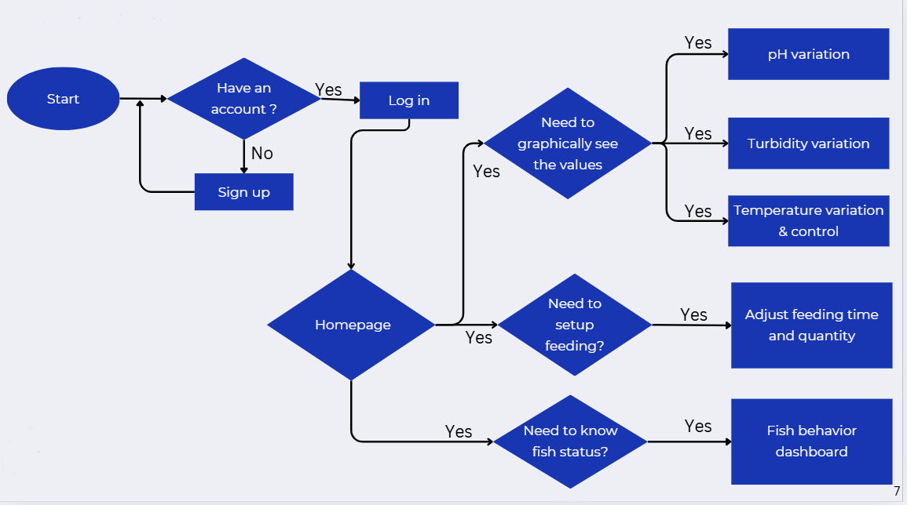
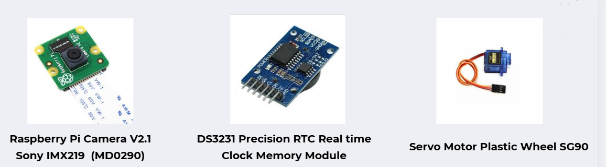

# AQUASENSE

## Smart Fish Tank monitoring & Controlling System

---
 
<p align="center">
  
</p>

To revolutionize aquarium care by introducing intelligent systems that ensure a healthy, stress-free environment for aquatic life, enhancing convenience for fish owners.

To develop an innovative, automated solution that simplifies aquarium management by providing real-time monitoring, intuitive control, and insights into the health and well-being of fish.

Maintaining optimal conditions in a fish tank requires constant attention, making it time-consuming and challenging, especially for beginners and those with busy schedules. Since fish cannot communicate their needs or health status, owners often remain unaware of issues until it’s too late.

## Team and ePortfolio

| Registration Numbers  | Name  | Email  | ePortfolio Link  |
|-----------------------|-------|--------|------------------ |
| E/20/016 | Kavindu Gajendra   | e20016@eng.pdn.ac.lk | https://www.thecn.com/EA768 |
| E/20/055 |   De Silva H.D.S.        |    e20055@eng.pdn.ac.lk    |             https://www.thecn.com/ED671          |
| E/20/231 |   Madhura T.W.K.J.        |   e20231@eng.pdn.ac.lk     |            https://www.thecn.com/EM1301            |
| E/20/404 |     Ukwaththa U.A.N.T.      |   e20404@eng.pdn.ac.lk     |       https://www.thecn.com/EU116                 |

## Problem Domain

- Inconsistent Environment Management
- Time-Consuming Maintenance
- Overfeeding and Underfeeding
- Understanding fish health and environmental conditions is challenging

## Our Solution

- Real-Time Monitoring: Sensors track water parameters such as temperature, pH levels, and turbidity.
- Automated Control: The system automates feeding and temperature regulation, reducing manual intervention for users.
- Live video streaming: Users can view the aquarium from anywhere anytime.
- Fish Behavior Monitoring: Detects irregular fish movements and low Oxygen levels notify users to potential health issue.
- Alert Systems: Continuously monitors the aquarium and sends notifications to users if unfavourable conditions arise.

## Solution Architecture

  <p align="center">
  
</p>

## User Flow

  <p align="center">
  
</p>

## Infrastructure

- Hardware Components

<p align="center">
  
</p>
<p align="center">
  
</p>
<p align="center">
  
</p>

## BOM

| Item                                                                | Unit Cost (LKR) | Quantity | Cost (LKR)  |
|---------------------------------------------------------------------|----------------|----------|-------------|
| Gravity Analog pH Sensor, DS18B20 Waterproof Digital Temperature Sensor | 5,520.00       | 1        | 5,520.00    |
| Raspberry Pi 3 Model B+, Peltier Module TEC1-12706, Cooling Fan 4010 Axial 40x40x10mm 5V | -            | 1       | -           |
| Aluminium Heatsink, Aluminium Water Block, Twisted Twin TT Cable, PCB Dot Board  | 1,340.00       | 1/1/1/1        | 1,340.00    |
| Servo Motor Plastic Wheel SG90 Full Set Normal                     | 395.00         | 1        | 395.00      |
| DS3231 Precision RTC Real time Clock Memory Module AT24C32 IIC ZS-042 | 480.00         | 1        | 480.00      |
| Raspberry Pi Camera V2.1 Sony IMX219 Sensor 8 Megapixel (MD0290)    | 8,350.00       | 1        | 8,350.00    |
| Double BTS7960B DC 43A Motor Driver H-Bridge PWM (MD0012)          | 1,450.00       | 1        | 1,450.00    |
| DFRobot Gravity: Analog Turbidity Sensor, ADS1115                   | -              | 1        | -           |
| DC 12V 5A Power Supply Unit, Silicon Pipe, JST XH Connector, Silicon Tube 35g  | 2,275.00       | 1/1/2/1     | 2,275.00    |
| Fish and Fish tank                                                 | 1,750.00       | 1        | 1,750.00    |
| Jumper wires, Breadboard, Ethernet Cable, Circuit Wire             | 1,797.50       | 60/2/1/3 | 1,797.50    |
| **Total**                                                          |                |          | **23,357.50** |

- "-" are received form the department

## Software & Tools

| Component | Technology |
|-----------|------------|
| Backend   | Node.js + Express |
| Database  | MySQL |
| Frontend  | Flutter (Mobile App) |
| Computer Vision | OpenCV (Python) |
| Hardware Control | Python + GPIO |
| Protocols | MQTT, I2C, 1-Wire, RSTP, Websockets |

## 🗂️ Project Structure

```
Aquasense/
│
├── code/
│ ├── Frontend/                         # Flutter mobile application (Frontend)
│ ├── backend/                          # Node.js backend
│ ├── Rasberry pi code/                 # Hardware control (GPIO & MQTT)
│ └── object-tracking-yolov8-deep-sort-master/        # Fish behavior detection (YOLO + Deep SORT)
│
├── docs/                               # Project page
│
└── README.md                           # Project overview and setup instructions
```

## Getting Started

### clone the Repository

```bash
git clone https://github.com/cepdnaclk/e20-3yp-Smart-Aquarium.git
cd e20-3yp-Smart-Aquarium
```

### frontend

```bash
cd code/Frontend
flutter pub get
flutter run
```

### backend

```bash
cd code/backend
npm install
npm start
```

## For More Details
- [Our Project Page](https://cepdnaclk.github.io/e20-3yp-Smart-Aquarium/)  
- [Department of Computer Engineering](https://www.ce.pdn.ac.lk/)  
- [Faculty Of Engineering University Of Peradeniya](https://eng.pdn.ac.lk/)  


  
  

