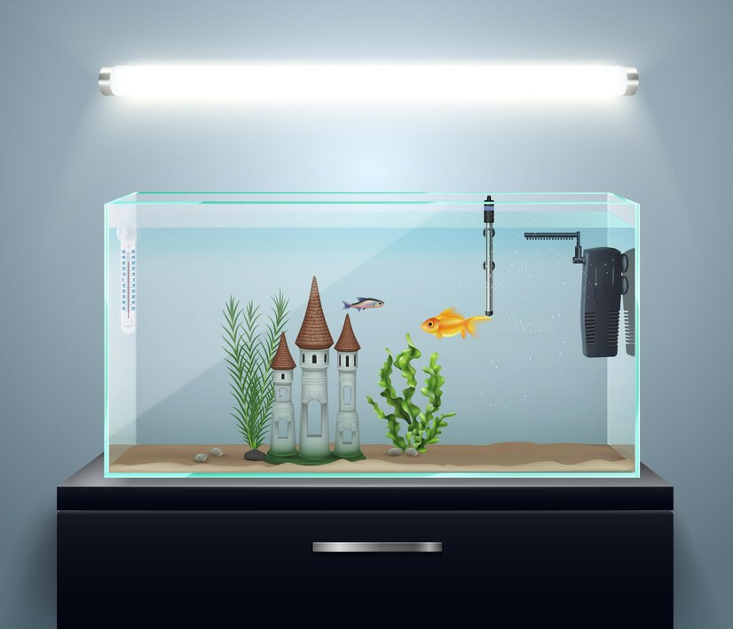

# AQUASENSE

## Smart Fish Tank monitoring & Controlling System

---

  

To revolutionize aquarium care by introducing intelligent systems that ensure a healthy, stress-free environment for aquatic life, enhancing convenience for fish owners.

To develop an innovative, automated solution that simplifies aquarium management by providing real-time monitoring, intuitive control, and insights into the health and well-being of fish.

Maintaining optimal conditions in a fish tank requires constant attention, making it time-consuming and challenging, especially for beginners and those with busy schedules. Since fish cannot communicate their needs or health status, owners often remain unaware of issues until it’s too late.

## Team and ePortfolio

| Registration Numbers  | Name  | Email  | ePortfolioe Link  |
|-----------------------|-------|--------|------------------ |
| E/20/016 | Kavindu Gajendra   | e20016@eng.pdn.ac.lk | https://www.thecn.com/EA768 |
| E/20/055 |   De Silva H.D.S.        |    e20055@eng.pdn.ac.lk    |             https://www.thecn.com/ED671          |
| E/20/231 |   Madhura T.W.K.J.        |   e20231@eng.pdn.ac.lk     |            https://www.thecn.com/EM1301            |
| E/20/404 |     Ukwaththa U.A.N.T.      |   e20404@eng.pdn.ac.lk     |       https://www.thecn.com/EU116                 |

## 1. Problem Domain

- Inconsistent Environment Management
- Time-Consuming Maintenance
- Overfeeding and Underfeeding
- Lack of Early Problem Detection

## 2. Our Solution

- Real-Time Monitoring: Sensors track water parameters such as temperature, pH levels, and turbidity, ensuring a stable environment.
- Automated Control: The system automates feeding and temperature regulation, reducing manual intervention for users.
- Fish Behaviour Monitoring: Detects irregular fish movements and alerts users to potential health issues.
- Alert Systems: Continuously monitors the aquarium and sends notifications to users if unfavourable conditions arise.

## 3. Solution Architecture

  

  

## 4. Infrastructure

- Hardware Components

  

  

  

## 4. BOM

  

- "-" are get form the department 

  
  

