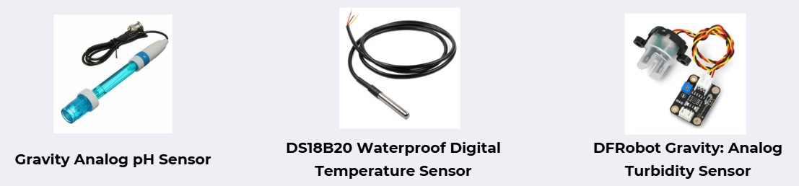

# AQUASENSE

## Smart Fish Tank monitoring & Controlling System

---
 
<p align="center">
  
</p>

To revolutionize aquarium care by introducing intelligent systems that ensure a healthy, stress-free environment for aquatic life, enhancing convenience for fish owners.

To develop an innovative, automated solution that simplifies aquarium management by providing real-time monitoring, intuitive control, and insights into the health and well-being of fish.

Maintaining optimal conditions in a fish tank requires constant attention, making it time-consuming and challenging, especially for beginners and those with busy schedules. Since fish cannot communicate their needs or health status, owners often remain unaware of issues until it’s too late.

## Team and ePortfolio

| Registration Numbers  | Name  | Email  | ePortfolio Link  |
|-----------------------|-------|--------|------------------ |
| E/20/016 | Kavindu Gajendra   | e20016@eng.pdn.ac.lk | https://www.thecn.com/EA768 |
| E/20/055 |   De Silva H.D.S.        |    e20055@eng.pdn.ac.lk    |             https://www.thecn.com/ED671          |
| E/20/231 |   Madhura T.W.K.J.        |   e20231@eng.pdn.ac.lk     |            https://www.thecn.com/EM1301            |
| E/20/404 |     Ukwaththa U.A.N.T.      |   e20404@eng.pdn.ac.lk     |       https://www.thecn.com/EU116                 |

## Problem Domain

- Inconsistent Environment Management
- Time-Consuming Maintenance
- Overfeeding and Underfeeding
- Understanding fish health and environmental conditions is challenging

## Our Solution

- Real-Time Monitoring: Sensors track water parameters such as temperature, pH levels, and turbidity.
- Automated Control: The system automates feeding and temperature regulation, reducing manual intervention for users.
- Live video streaming: Users can view the aquarium from anywhere anytime.
- Fish Behavior Monitoring: Detects irregular fish movements and low Oxygen levels notify users to potential health issue.
- Alert Systems: Continuously monitors the aquarium and sends notifications to users if unfavourable conditions arise.

## Solution Architecture

  <p align="center">
  
</p>

## User Flow

  <p align="center">
  
</p>

## Infrastructure

- Hardware Components

<p align="center">
  
</p>
<p align="center">
  
</p>
<p align="center">
  
</p>

## BOM

| Item                                                                | Unit Cost (LKR) | Quantity | Cost (LKR)  |
|---------------------------------------------------------------------|----------------|----------|-------------|
| Gravity Analog pH Sensor, DS18B20 Waterproof Digital Temperature Sensor | 5,520.00       | 1        | 5,520.00    |
| Raspberry Pi 3 Model B+, Peltier Module TEC1-12706, Cooling Fan 4010 Axial 40x40x10mm 5V | 19,090.00         | 1/1/1       | 19,090.00        |
| Aluminium Heatsink, Aluminium Water Block, Twisted Twin TT Cable, PCB Dot Board  | 1,340.00       | 1/1/1/1        | 1,340.00    |
| Servo Motor Plastic Wheel SG90 Full Set Normal                     | 395.00         | 1        | 395.00      |
| DS3231 Precision RTC Real time Clock Memory Module AT24C32 IIC ZS-042 | 480.00         | 1        | 480.00      |
| Raspberry Pi Camera V2.1 Sony IMX219 Sensor 8 Megapixel (MD0290)    | 8,350.00       | 1        | 8,350.00    |
| Double BTS7960B DC 43A Motor Driver H-Bridge PWM (MD0012)          | 1,450.00       | 1        | 1,450.00    |
| DFRobot Gravity: Analog Turbidity Sensor, ADS1115                   | 3,460.00           | 1/1        | 3,460.00         |
| DC 12V 5A Power Supply Unit, Silicon Pipe, JST XH Connector, Silicon Tube 35g  | 2,275.00       | 1/1/2/1     | 2,275.00    |
| Fish and Fish tank                                                 | 1,750.00       | 1        | 1,750.00    |
| Jumper wires, Breadboard, Ethernet Cable, Circuit Wire             | 1,797.50       | 60/2/1/3 | 1,797.50    |
| **Total**                                                          |                |          | **45,907.50** |

## Software & Tools

| Component | Technology |
|-----------|------------|
| Backend   | Node.js + Express |
| Database  | MySQL |
| Frontend  | Flutter (Mobile App) |
| Computer Vision | OpenCV (Python) |
| Hardware Control | Python + GPIO |
| Protocols | MQTT, I2C, 1-Wire, RSTP, Websockets |

## 🗂️ Project Structure

```
Aquasense/
│
├── code/
│ ├── Frontend/                         # Flutter mobile application (Frontend)
│ ├── backend/                          # Node.js backend
│ ├── Rasberry pi code/                 # Hardware control (GPIO & MQTT)
│ └── object-tracking-yolov8-deep-sort-master/        # Fish behavior detection (YOLO + Deep SORT)
│
├── docs/                               # Project page
│
└── README.md                           # Project overview and setup instructions
```

## Prerequisites

Before setting up AquaSense, ensure you have the following installed:

### Software Requirements
- **Node.js** (v14.x or higher) and npm
- **Flutter SDK** (v3.0 or higher)
- **MySQL** (v8.0 or higher)
- **Python** (v3.7 or higher)
- **Git**

### Hardware Requirements
- Raspberry Pi 3 Model B+ or higher
- Sensors (pH, Temperature, Turbidity)
- Camera module
- Motor drivers and actuators
- See [BOM](#bom) section for complete hardware list

### Optional Tools
- MySQL Workbench (for database management)
- Postman (for API testing)
- Android Studio or VS Code (for development)

## Getting Started

### 1. Clone the Repository

```bash
git clone https://github.com/cepdnaclk/e20-3yp-Smart-Aquarium.git
cd e20-3yp-Smart-Aquarium
```

### 2. Backend Setup

#### Install Dependencies

```bash
cd code/backend
npm install
```

#### Configure Database

1. Create a MySQL database:
```sql
CREATE DATABASE aquasense;
```

2. Update database credentials in `config/config.json`:
```json
{
  "development": {
    "username": "your_mysql_username",
    "password": "your_mysql_password",
    "database": "aquasense",
    "host": "127.0.0.1",
    "dialect": "mysql"
  }
}
```

#### Run Database Migrations

```bash
npx sequelize-cli db:migrate
```

#### Start the Backend Server

```bash
# Development mode (with auto-restart)
npm run dev

# Production mode
npm start
```

The backend server will run at `http://localhost:3001`

### 3. Frontend Setup

#### Install Flutter Dependencies

```bash
cd code/Frontend
flutter pub get
```

#### Configure Backend URL

Update the backend API URL in the app configuration to match your backend server address.

For Android Emulator: `http://10.0.2.2:3001`
For Physical Device: `http://<your_computer_ip>:3001`

#### Run the Mobile App

```bash
# List available devices
flutter devices

# Run on connected device
flutter run

# Run on specific device
flutter run -d <device_id>
```

### 4. Object Tracking Setup (Computer Vision)

#### Install Python Dependencies

```bash
cd code/object-tracking-yolov8-deep-sort-master
pip install -r requirements.txt
```

#### Download Model Weights

Download the Deep SORT feature extraction model from:
[Google Drive Link](https://drive.google.com/open?id=18fKzfqnqhqW3s9zwsCbnVJ5XF2JFeqMp)

Place the downloaded model in the `deep_sort/model_data/` directory.

#### Run Object Tracking

```bash
python main.py
```

### 5. Raspberry Pi Setup

#### Extract Hardware Control Code

```bash
cd code/Rasberry\ pi\ code/
7z x "Rasberry pi code.7z"
```

#### Install Required Libraries

```bash
pip install RPi.GPIO
pip install paho-mqtt
pip install adafruit-circuitpython-ads1x15
```

#### Configure and Run

See the [Raspberry Pi README](code/Rasberry%20pi%20code/README.md) for detailed setup instructions including GPIO pin configuration and MQTT settings.

## 🔧 Configuration

### Environment Variables

#### Backend (.env file)
Create a `.env` file in `code/backend/` with:
```
PORT=3001
DB_HOST=localhost
DB_USER=your_username
DB_PASSWORD=your_password
DB_NAME=aquasense
JWT_SECRET=your_jwt_secret
MQTT_BROKER=mqtt://localhost:1883
```

#### Raspberry Pi
Configure MQTT broker settings and GPIO pin assignments in the hardware control scripts.

### API Endpoints

#### Authentication
- `POST /api/register` - Register new user
- `POST /api/login` - User login

#### Sensor Data
- `GET /api/sensors/current` - Get current sensor readings
- `GET /api/sensors/history` - Get historical sensor data

#### Control
- `POST /api/control/feed` - Trigger fish feeding
- `POST /api/control/temperature` - Set target temperature

See the [Backend README](code/backend/README.md) for complete API documentation.

## 🐛 Troubleshooting

### Common Issues

#### Backend won't start
- Verify MySQL is running: `sudo service mysql status`
- Check database credentials in `config/config.json`
- Ensure port 3001 is not in use: `lsof -i :3001`

#### Flutter build errors
- Run `flutter clean` then `flutter pub get`
- Check Flutter SDK version: `flutter --version`
- Ensure Android SDK is properly configured

#### Database migration errors
- Drop existing database and recreate: `DROP DATABASE aquasense; CREATE DATABASE aquasense;`
- Run migrations again: `npx sequelize-cli db:migrate`

#### Raspberry Pi sensor errors
- Check GPIO pin connections
- Verify sensor power supply (3.3V or 5V as required)
- Test I2C devices: `i2cdetect -y 1`

#### Object tracking not detecting fish
- Verify camera is properly connected
- Check model weights are downloaded
- Adjust detection confidence threshold in configuration

## 🤝 Contributing

We welcome contributions to AquaSense! Please follow these steps:

1. Fork the repository
2. Create a feature branch (`git checkout -b feature/AmazingFeature`)
3. Commit your changes (`git commit -m 'Add some AmazingFeature'`)
4. Push to the branch (`git push origin feature/AmazingFeature`)
5. Open a Pull Request

### Development Guidelines
- Follow existing code style and conventions
- Write clear commit messages
- Update documentation for any new features
- Test thoroughly before submitting PR

## 📄 License

This project is part of the Department of Computer Engineering, University of Peradeniya.

## 🙏 Acknowledgments

- Department of Computer Engineering, University of Peradeniya
- Project supervisors and mentors
- All contributors and testers

## 📞 Support

For questions or support:
- Create an issue in this repository
- Contact team members via provided emails
- Visit our [Project Page](https://cepdnaclk.github.io/e20-3yp-Smart-Aquarium/)

## 🔗 For More Details
- [Our Project Page](https://cepdnaclk.github.io/e20-3yp-Smart-Aquarium/)  
- [Department of Computer Engineering](https://www.ce.pdn.ac.lk/)  
- [Faculty Of Engineering University Of Peradeniya](https://eng.pdn.ac.lk/)  

---

**Note**: This is an academic project developed as part of the Third Year Project at the Department of Computer Engineering, University of Peradeniya.

