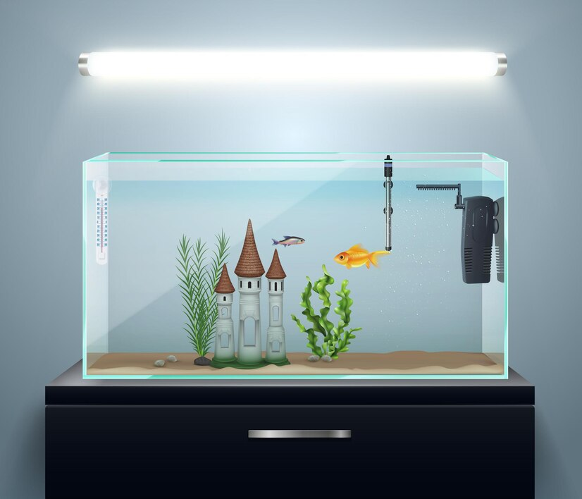
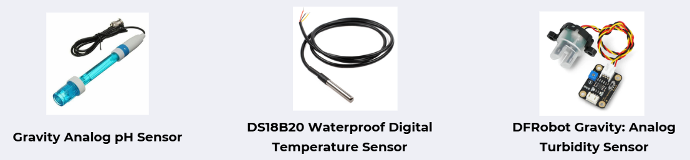
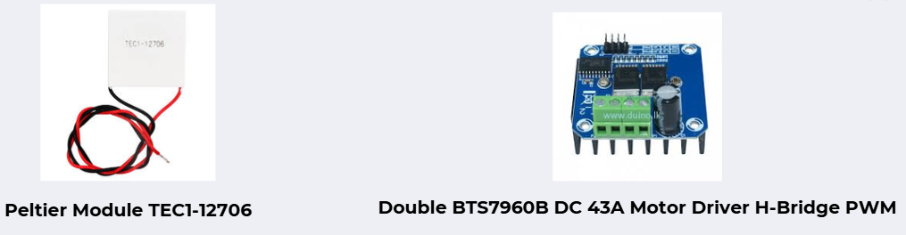

[comment]: # "This is the standard layout for the project, but you can clean this and use your own template"

# Smart Fish Tank monitoring & Controlling System

<!-- Image (photo/drawing of the final hardware) should be here -->

<!-- This is a sample image, to show how to add images to your page. To learn more options, please refer [this](https://projects.ce.pdn.ac.lk/docs/faq/how-to-add-an-image/) -->

<!--  -->

  

## Team
-  E/20/016, Kavindu Gajendra, [email](e20016@eng.pdn.ac.lk)
-  E/20/055, De Silva H.D.S., [email](e20055@eng.pdn.ac.lk)
-  E/20/231, Madhura T.W.K.J., [email](e20231@eng.pdn.ac.lk)
-  E/20/404, Ukwaththa U.A.N.T., [email](e20404@eng.pdn.ac.lk)

## 1. Problem Domain

-  Inconsistent Environment Management
-  Time-Consuming Maintenance
-  Overfeeding and Underfeeding
-  Lack of Early Problem Detection
  
## 2. Our Solution

- Real-Time Monitoring: Sensors track water parameters such as temperature, pH levels, and turbidity, ensuring a stable environment.
- Automated Control: The system automates feeding and temperature regulation, reducing manual intervention for users.
- Fish Behaviour Monitoring: Detects irregular fish movements and alerts users to potential health issues.
- Alert Systems: Continuously monitors the aquarium and sends notifications to users if unfavourable conditions arise.

## 3. Solution Architecture

  

  

## 4. Infrastructure

- Hardware Components

  

  

  

## 4. BOM

| Item                                                                | Unit Cost (LKR) | Quantity | Cost (LKR)  |
|---------------------------------------------------------------------|----------------|----------|-------------|
| Gravity Analog pH Sensor, DS18B20 Waterproof Digital Temperature Sensor | 5,520.00       | 1        | 5,520.00    |
| Raspberry Pi 3 Model B+                                            | -              | 1        | -           |
| Peltier Module TEC1-12706, Aluminium Heatsink, Cooling Fan 4010 Axial 40x40x10mm 5V | 1,010.00       | 1        | 1,010.00    |
| Servo Motor Plastic Wheel SG90 Full Set Normal                     | 395.00         | 1        | 395.00      |
| DS3231 Precision RTC Real time Clock Memory Module AT24C32 IIC ZS-042 | 480.00         | 1        | 480.00      |
| Raspberry Pi Camera V2.1 Sony IMX219 Sensor 8 Megapixel (MD0290)    | 6,950.00       | 1        | 6,950.00    |
| Double BTS7960B DC 43A Motor Driver H-Bridge PWM (MD0012)          | 1,080.00       | 1        | 1,080.00    |
| DFRobot Gravity: Analog Turbidity Sensor, ADS1115                   | -              | 1        | -           |
| DC 12V 5A Power Supply Unit                                        | 1,850.00       | 1        | 1,850.00    |
| Fish and Fish tank                                                 | 1,800.00       | 1        | 1,800.00    |
| Jumper wires, Breadboard, Ethernet Cable                           | 1,417.50       | 60/1/1   | 1,417.50    |
| **Total**                                                          |                |          | **20,502.50** |

- "-" are get form the department 
## Links

- [Project Repository](https://github.com/cepdnaclk/e20-3yp-Smart-Aquarium)
- [Project Page](https://cepdnaclk.github.io/e20-3yp-Smart-Aquarium)
- [Department of Computer Engineering](http://www.ce.pdn.ac.lk/)
- [University of Peradeniya](https://eng.pdn.ac.lk/)

[//]: # (Please refer this to learn more about Markdown syntax)
[//]: # (https://github.com/adam-p/markdown-here/wiki/Markdown-Cheatsheet)
